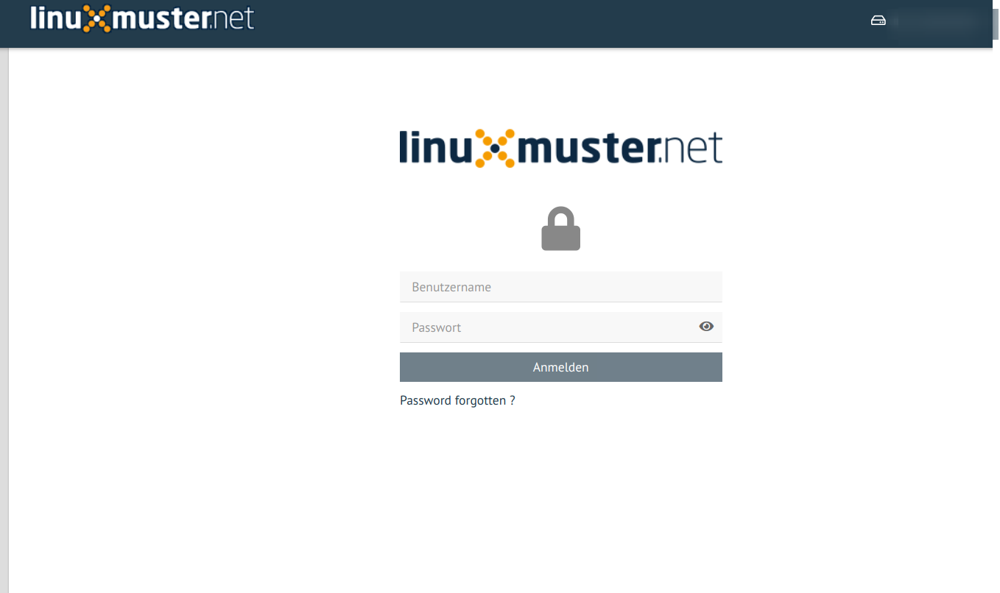

Plugin lmn_auth
***************

This plugin doesn't have any view at all. It only provides a class in order to allow authentification and profile management against the LDAP server used in Samba 4.

Once an user is authenticated, a new worker is created with restricted permissions ( same uid and gid as the user ). This means that an user can only perform limited tasks on the server.

